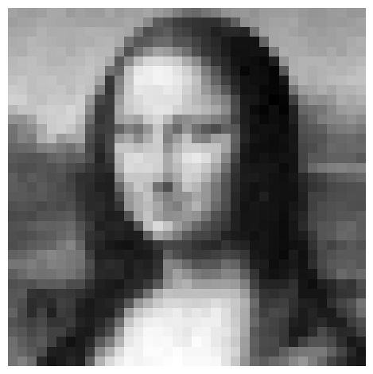

# Bayesian Image Super-Resolution

Bayesian super-resolution is a technique used to enhance the resolution of images by incorporating Bayesian inference principles. It involves estimating the likelihood function for the image registration parameters through marginalization over the unknown high-resolution image. This approach allows for the estimation of the unknown point spread function and is made tractable by introducing a Gaussian process prior over images.

This repository contains the PyTorch implementation of the Bayesian super-resolution algorithm proposed by Tipping et al. 

Here is an example of the algorithm applied to the Mona Lisa image:

| Low Resolution Image | High Resolution Image |
|-----------------------|----------------------|
|  |  | 

## Reference
[Michael Tipping and Christopher Bishop. Bayesian image super-resolution. Advances in neural information processing systems, 15, 2002.](https://proceedings.neurips.cc/paper_files/paper/2002/file/88bfcf02e7f554f9e9ea350b699bc6a7-Paper.pdf).
